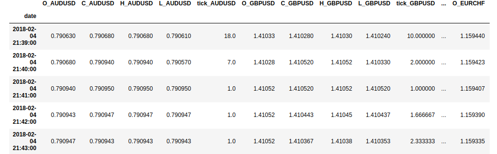
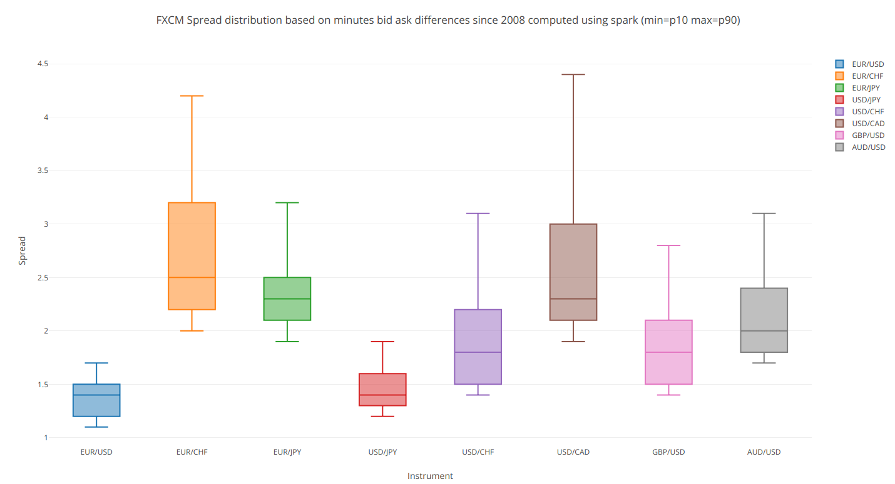
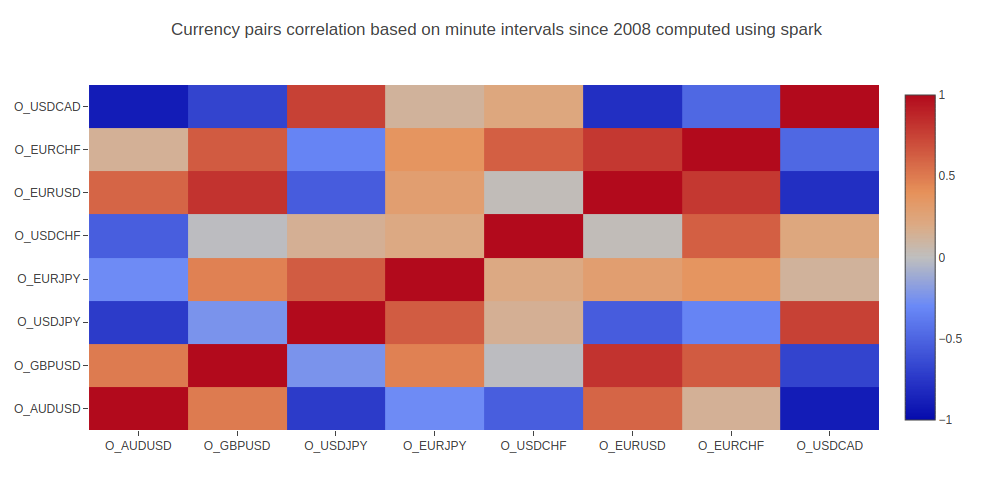

# Overview

This python project explores forex data mainly focussed on minutes intervals

The historic data is imported using [FXCM](https://www.fxcm.com) python API and store in [parquet](https://parquet.apache.org/) format

10 years of 8 pairs are stored in the Data folder

The pairs are :

- EUR/USD (Euro – US dollar)
- EUR/CHF (Euro - Swiss franc )
- EUR/JPY (Euro - Japanese yen)
- USD/JPY (US dollar – Japanese yen)
- USD/CHF (US dollar – Swiss franc)
- USD/CAD (US dollar – Canadian dollar)
- GBP/USD (British pound – US dollar)
- AUD/USD (Australian dollar – US dollar)

It represents almost 30 millions of valid candles over 46 millions of samples ( every minutes for 10 years )


## Requirements :

- install [spark](https://spark.apache.org/) ( 2.3 recommended for later ) 

create a virtualenv and install python packages:

```console
pip install -r requirements.txt
```

## Data

Minute interval data are stored in parquet in the data folder.

The schema is :

- Each row is a minute of 40 columns = 5 (OHLCV) * 8 (pairs)



To create a pyspark dataframe :

```python
dfjoin = spark.read.parquet("data/forexdatajoin/") 
```

## Step1_fxmdata_to_parquet

This notebook import the data from FXCM and store data in parquet

a FXCM account is needed in order to run it

- free [fxcm](https://www.fxcm.com) demo account.


for testing it computes the spread over ten years minute by minute of the 8 pairs 

### Spread over ten years



## Step2_overview

This notebook will explore the data stored in the data folder

### Example of ten years pairs correlation



## Next 

- Data pre-processing ( cleaning,trend,normalization )
- Compute Technical indactors
- Cloud deployment via k8
- Explore Mllib and other machine learning frameworks combined with spark for hyperparameter tuning ( RL ? ).
